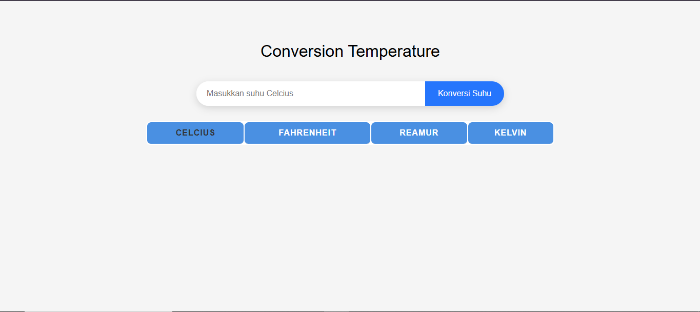
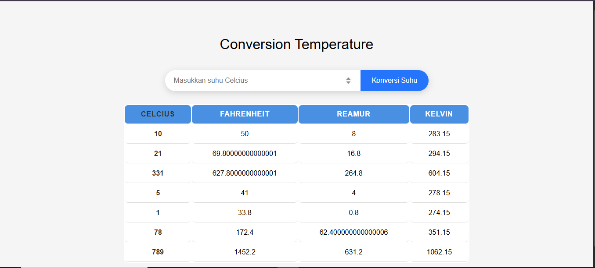

# Conversion Temperature
Membuat tampilan web untuk konversi suhu dari Celcius ke Fahrenheit,Reamur dan Kelvin menggunakan HTML, CSS dan JavaScript DOM 

# Tampilan

## Sebelum di input

## Sesudah di masukan input

## Tampilan Mobile
.png)